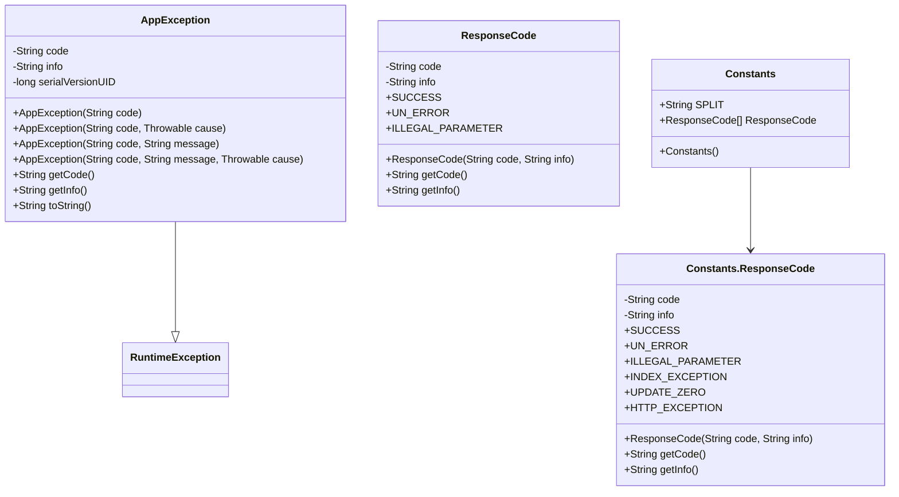

# ai-agent-station-types 类设计文档

## 六、ai-agent-station-types

### 6.1 模块概述

`ai-agent-station-types` 是一个**类型定义模块**，主要负责定义系统中使用的各种类型、常量和异常。它是整个 `ai-agent-station` 系统的基础类型库，为其他模块提供统一的类型定义和异常处理标准。

### 6.2 功能分析

该模块主要包含以下功能：
1. **异常类型 (Exception)**: 定义应用程序的自定义异常类
2. **枚举类型 (Enums)**: 定义响应码等枚举常量
3. **通用常量 (Common)**: 定义系统通用常量和配置

### 6.3 类图设计



### 6.4 类的详细设计

#### 6.4.1 AppException 异常类

**功能描述**: 自定义应用程序异常类，继承自RuntimeException，提供统一的异常处理机制。

**属性**:
- `code`: 异常码，用于标识异常类型
- `info`: 异常信息，描述异常详情
- `serialVersionUID`: 序列化版本号

**构造函数**:
```java
// 仅包含异常码
public AppException(String code)

// 包含异常码和原始异常
public AppException(String code, Throwable cause)

// 包含异常码和异常信息
public AppException(String code, String message)

// 包含异常码、异常信息和原始异常
public AppException(String code, String message, Throwable cause)
```

**方法**:
```java
// 获取异常码
public String getCode()

// 获取异常信息
public String getInfo()

// 重写toString方法，提供友好的异常描述
@Override
public String toString()
```

**使用场景**:
- 业务逻辑异常处理
- 参数验证失败
- 系统配置错误
- 外部服务调用异常

#### 6.4.2 ResponseCode 枚举类

**功能描述**: 定义系统标准响应码，提供统一的响应状态标识。

**枚举值**:
- `SUCCESS("0000", "成功")`: 操作成功
- `UN_ERROR("0001", "未知失败")`: 未知错误
- `ILLEGAL_PARAMETER("0002", "非法参数")`: 参数错误

**属性**:
- `code`: 响应码字符串
- `info`: 响应描述信息

**构造函数**:
```java
// 全参构造函数
ResponseCode(String code, String info)
```

**方法**:
```java
// 获取响应码
public String getCode()

// 获取响应描述
public String getInfo()
```

**使用场景**:
- API接口响应状态
- 业务操作结果标识
- 错误码统一管理

#### 6.4.3 Constants 常量类

**功能描述**: 定义系统通用常量和配置，提供集中的常量管理。

**常量**:
- `SPLIT`: 分隔符常量，值为","

**内部枚举**:
- `ResponseCode`: 扩展的响应码枚举，包含更多状态

**内部枚举值**:
- `SUCCESS("0000", "成功")`
- `UN_ERROR("0001", "未知失败")`
- `ILLEGAL_PARAMETER("0002", "非法参数")`
- `INDEX_EXCEPTION("0003", "唯一索引冲突")`
- `UPDATE_ZERO("0004", "更新记录为0")`
- `HTTP_EXCEPTION("0005", "HTTP接口调用异常")`

**构造函数**:
```java
// 默认构造函数
public Constants()
```

**内部枚举方法**:
```java
// 获取响应码
public String getCode()

// 获取响应描述
public String getInfo()
```

**使用场景**:
- 系统分隔符定义
- 扩展响应码管理
- 通用配置常量

### 6.5 设计原则

1. **单一职责**: 每个类只负责一个特定的功能领域
2. **开闭原则**: 通过枚举扩展支持新的响应码，无需修改现有代码
3. **依赖倒置**: 异常类继承标准异常，保持与Java异常体系的一致性
4. **接口隔离**: 提供最小化的公共接口，避免不必要的依赖

### 6.6 扩展性设计

1. **异常扩展**: 可以通过继承AppException创建特定业务异常
2. **响应码扩展**: 可以在ResponseCode枚举中添加新的状态码
3. **常量扩展**: 可以在Constants类中添加新的常量定义

### 6.7 使用示例

#### 异常使用示例
```java
// 创建业务异常
throw new AppException("USER_NOT_FOUND", "用户不存在");

// 包装原始异常
try {
    // 业务逻辑
} catch (Exception e) {
    throw new AppException("BUSINESS_ERROR", "业务处理失败", e);
}
```

#### 响应码使用示例
```java
// 获取响应码
String code = ResponseCode.SUCCESS.getCode(); // "0000"
String info = ResponseCode.SUCCESS.getInfo(); // "成功"

// 在API响应中使用
return new ApiResponse(ResponseCode.SUCCESS.getCode(), "操作成功");
```

#### 常量使用示例
```java
// 使用分隔符
String[] items = input.split(Constants.SPLIT);

// 使用扩展响应码
String code = Constants.ResponseCode.INDEX_EXCEPTION.getCode(); // "0003"
```

这个模块设计为整个系统提供了统一的类型定义基础，确保异常处理、响应码管理和常量使用的一致性。
