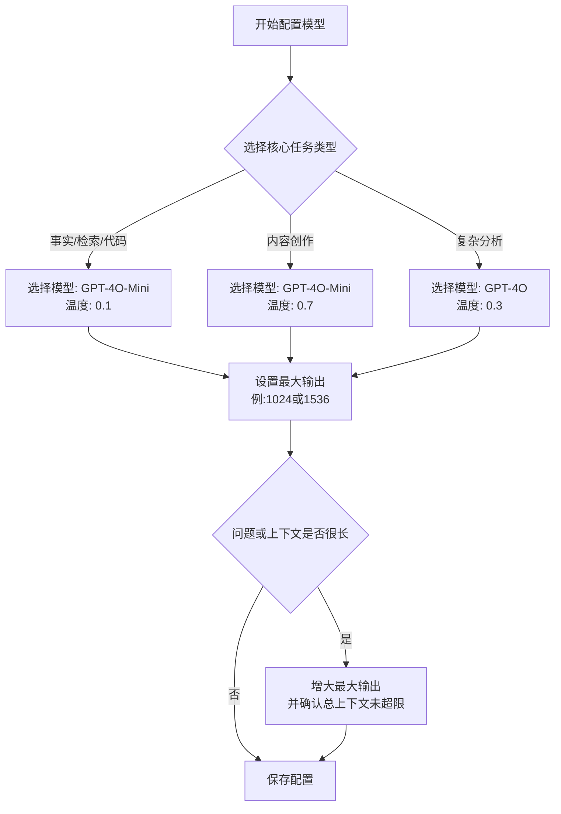
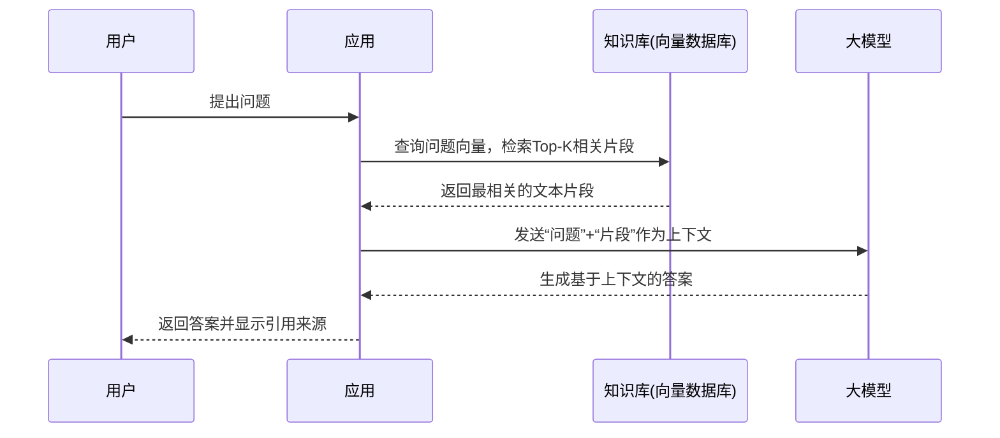
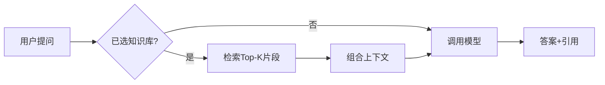
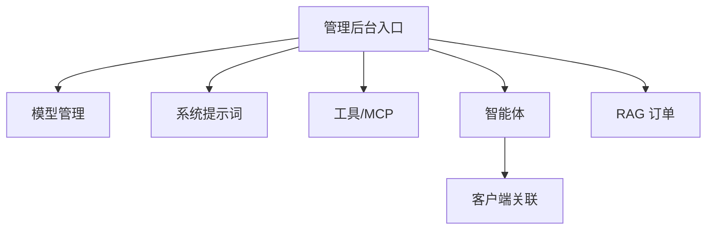

# AI 智能文档平台 - 帮助中心

> 欢迎使用 AI 智能文档平台！本帮助中心将引导您快速上手并高效利用平台能力。内容分为：**核心概念**、**使用指南**、**进阶技巧**与**常见问题**。

---

## 一、核心概念与配置

在开始前，了解几个核心概念能让您更好地配置和使用平台。

### 1. 对话模型 (LLM) 选型指南
-   **温度 (Temperature)**：
    -   `0.0 - 0.3`：**确定性高**，适用于事实问答、数据提取、代码生成等要求准确、可重复的场景。
    -   `0.4 - 0.7`：**创造性适中**，适用于内容创作、头脑风暴、撰写邮件等需要一定灵活性的任务。
    -   `0.8 - 1.0`：**创造性极高**，输出结果更多样、不可预测，仅用于创意写作等特殊场景。
-   **最大输出 (Max Tokens)**：限制单次回答的长度。建议设为 `1024` 或 `1536`。如果问题复杂或要求详细回答，可适当增加。
-   **上下文长度 (Context Window)**：模型能处理的“当前对话+历史记录+检索知识”的总字数上限。请确保您的总用量不超过所选模型的限制。

平台的配置流程遵循一个清晰的决策路径，如下图所示：

### 2. RAG 检索是如何工作的？

RAG (Retrieval-Augmented Generation) 是平台的核心技术，它让模型能够从您提供的知识库中获取信息来回答问题。

1.  **处理与分块 (Chunking)**：您上传的文档会被文本提取并切分成较小的片段（通常为 500-1000 个 tokens）。片段之间会有少量重叠（50-150 tokens），以确保上下文连贯。
2.  **索引 (Indexing)**：这些文本片段会被转换为向量（一种数学表示）并存入向量数据库，以便快速检索。
3.  **检索 (Retrieval)**：当您提问时，系统将您的问题也转换为向量，并在数据库中快速查找最相似的 `Top-k` 个文本片段。
4.  **增强生成 (Augmented Generation)**：检索到的相关片段会作为上下文，与您的问题一起发送给大模型。模型据此生成答案，并通常会附上引用的来源。

### 3. 常用场景配置模板

您可以基于以下模板快速创建高质量对话。

| 场景 | 温度 | 检索 Top-K | 最大输出 | 关键配置 | 系统提示词要点 |
| :--- | :--- | :--- | :--- | :--- | :--- |
| **通用问答** | 0.1 | 5 | 1024 | 开启引用 | “请基于提供的上下文回答问题，答案应准确简洁。” |
| **法规/合同审查** | 0.0 | 6-8 | 1536 | 开启引用，低温度 | “你是一名法律顾问。严格基于合同条款分析，每条结论必须附带引用和原文出处。” |
| **代码生成/分析** | 0.1 - 0.2 | 3-5 | 2048 | 可放宽超时 | “你是一名资深工程师。分析代码逻辑或生成代码，要求格式规范，注释清晰。” |
| **创意与写作** | 0.7 - 0.9 | (可选) | 1024-2048 | 可不启用检索 | “你是一个创意写作助手。协助用户进行头脑风暴和内容创作。” |

---

## 二、使用指南

### 开始使用：三步上手

1.  **构建知识库**：进入“知识库”菜单，通过“上传文件”或“解析 Git 仓库”添加您的资料。系统将自动进行解析和索引。
2.  **开始对话**：进入“AI 对话”界面，在右侧面板选择上一步创建的知识库。
3.  **提问与验证**：在输入框中提出您的问题。如果答案中包含引用，可以展开查看具体来源于哪个文档的哪个片段。

### 最佳实践：如何高效提问

-   **明确目标**：提问应清晰具体。
    -   **不佳**：“说说这个文档”
    -   **优秀**：“基于我上传的《2024年营销策略》文档，总结前三点的核心目标”
-   **指定格式**：要求模型结构化输出。
    -   **示例**：“以表格形式列出上述风险的应对措施，包含‘风险点’、‘可能影响’、‘建议措施’三列”
-   **逐步细化**：先获取总览，再深入细节。
    -   先问：“这篇研报的主要结论是什么？”
    -   再问：“针对第三个结论，有哪些支持性的数据？”

---

## 三、进阶技巧

### 1. 编写高质量提示词 (Prompt)

在提问时提供清晰的指令和背景，可以获得质量高得多的回复。

-   **限定领域与角色**：
    > “你是我的人力资源专家助理。请基于《员工手册》知识库回答：新员工入职第一周需要完成哪些流程？请按时间顺序列出。”

-   **要求结构化输出**：
    > “请将答案组织成 Markdown 表格，包含以下列：[功能模块, 主要接口, 文档来源]。”

-   **强调引用与溯源**：
    > “请务必为答案中的每一个关键数据点和条款规定附上准确的引用片段和文件名。”

### 2. 优化检索效果

-   **调整检索范围**：如果检索到的内容不相关，可以尝试适当增加 `Top-K` 的值（例如从5调到8），让模型看到更多的候选片段。
-   **检查文档质量**：检索效果依赖于原始文档的质量。确保上传的文档文本清晰（非扫描图片）、结构完整。

---

## 四、常见问题 (FAQ)

### 一般问题

**Q: 我上传文件后，为什么检索不到内容？**
A: 文件上传后需要经历解析、分块和索引的过程，这需要一定时间（取决于文件大小和数量）。请稍等几分钟再尝试。大型仓库或文档可能需要更长时间。

**Q: 如何查看答案的引用来源？**
A: 在AI对话界面，如果答案来自知识库，消息旁通常会显示引文标志（如📎）或直接注明“来源”。点击即可展开查看具体的原文片段和出自哪个文档。

**Q: 平台支持哪些文件类型？**
A: 支持常见格式，包括：`.pdf`, `.docx`, `.pptx`, `.txt`, `.md` (Markdown), `.html` 以及代码文件（如 `.py`, `.js`, `.java` 等）。

**Q: 能否调整AI回复的语言风格？**
A: 可以。通过在“系统提示词”中指定，例如添加“请用技术文档的风格回答”或“请用简洁易懂的口语化方式解释”。

### 故障排查

**Q: 上传文件后，长时间显示“处理中”或失败怎么办？**
A: 首先请检查文件格式和大小是否在限制范围内。若问题依旧，可能是解析服务偶发错误，请尝试重新上传或联系管理员查看后台日志。

**Q: 答案中没有显示引用，是为什么？**
A: 1) 您当前可能未选择知识库，模型在凭自身知识作答；2) 您的问题过于通用，未触发知识库检索；3) 知识库中可能没有与您问题高度相关的内容。请尝试更具体的问题或扩大检索范围（Top-K）。

---

## 五、功能手册

### 1. AI 对话（Chat）

- 作用：与大模型进行自然语言交互，可结合所选知识库进行检索增强回答。
- 入口：顶部导航进入“AI 对话”。
- 关键操作：
  - 选择智能体与知识库；
  - 输入问题，查看答案与引用来源；
  - 使用下拉菜单“上传知识/解析Git”快速前往构建知识；
  - 支持多轮对话与历史记录管理（新建、删除、清空）。
- 小技巧：提问时明确目标和输出格式（如“用表格列出…”），答案更稳定。

### 2. 知识库 - 上传文件（Upload）

- 作用：将 PDF/DOCX/MD/TXT 等文件解析为可检索的片段，供对话时引用。
- 入口：导航“上传文件”。
- 关键操作：
  - 选择或创建目标知识库；
  - 拖拽或点击选择文件；
  - 开始上传并查看进度；
  - 上传完成后，稍等解析与索引。
- 注意：扫描版 PDF 建议先做 OCR；大文件解析时间更长。

### 3. 知识库 - 解析 Git 仓库（Git）

- 作用：将代码仓或文档仓的内容拉取、解析并建立向量索引，便于检索代码/文档。
- 入口：导航“Git 仓库”。
- 关键操作：
  - 配置仓库地址与访问令牌；
  - 选择需要纳入的目录/文件类型；
  - 触发同步，等待解析与索引完成；
  - 在“AI 对话”中选择该知识库提问。
- 建议：为代码与文档分别设置知识库，提问更精准。

### 4. 管理后台（Admin）

用于统一治理“模型资源、提示词资产、可调用工具、智能体形态与任务编排”。模块职责与专业要点如下：

- AI 智能体管理（`/admin/ai-agent`）
  - 职责：以“配置实体”的形式沉淀一个可复用对话角色，封装模型（model）、系统提示词（system prompt）、可调用工具（tools）、默认参数（temperature、max_tokens 等）。
  - 关键字段：`agentId`、`displayName`、`modelAlias`、`promptRefs[]`、`toolRefs[]`、`ioPolicies`（输入输出策略）。
  - 最佳实践：按业务域拆分智能体，例如“通用助手/法务助手/代码助手”；将格式约束与风格拆为独立提示词片段，通过 `promptRefs` 组合。

- 智能体客户端关联（`/admin/ai-agent-client`）
  - 职责：在客户端维度（页面/租户/环境）绑定允许使用的 `agentId` 列表，形成访问控制（Allowlist）。
  - 要点：支持灰度发布与回滚；建议为关键页面配置“兜底智能体”。

- AI 代理任务调度（`/admin/ai-agent-task`）
  - 职责：定义/编排需要多步骤或异步执行的代理任务（Agentic Workflow），并提供队列、并发与重试参数。
  - 指标：任务吞吐、失败率、平均时延；支持 DLQ（死信队列）与人工复核。

- 客户端顾问管理（`/admin/ai-client-advisor`、`/admin/ai-client-advisor-config`）
  - 职责：面向特定场景的“顾问”角色配置（如法务、数据分析），在客户端维度下发默认系统提示词、上下文拼接策略与输出协议（schema）。
  - 要点：不同顾问可共用同一模型，但提示词/格式策略不同；可通过版本号做 A/B 实验。

- 客户端模型管理（`/admin/ai-client-model`、`/admin/ai-client-model-config`）
  - 职责：维护可用模型池与别名映射（如 `gpt-4o-mini@prod` → 真实供应商型号），并按页面或角色下发默认模型与参数阈值。
  - 要点：记录上下文上限、价格、SLA 与地区；为关键路径设置“降级别名”，便于限流或故障切换。

- 系统提示词管理（`/admin/ai-client-system-prompt`）
  - 职责：对提示词进行模块化与版本化管理（身份/目标/风格/格式/安全策略），支持片段复用与审计留痕。
  - 要点：将“格式契约”与“内容策略”分离；对敏感条款加标签与变更审批。

- 客户端工具配置（`/admin/ai-client-tool-config`）
  - 职责：以 JSON Schema 形式注册可调用工具，定义函数签名、参数校验、超时/幂等等运行策略与安全沙箱（白名单域）。
  - 要点：最小授权（Least Privilege）、参数边界校验、调用频控；对外部依赖加熔断与降级。

- MCP 工具管理（`/admin/ai-client-tool-mcp`）
  - 职责：按 MCP 协议接入远程工具/服务，维护端点、协议版本、鉴权与可用性探测。
  - 要点：健康检查与日志追踪（TraceId）；异常场景自动摘除与恢复。

- RAG 订单管理（`/admin/ai-rag-order`）
  - 职责：对检索与生成请求进行计费与审计，追踪每次查询所用的索引版本、Top‑k、重排策略与片段来源。
  - 要点：出账透明（per‑request 明细）、可回溯（来源与参数完整记录）、支持成本归因（按租户/页面/智能体维度）。

---